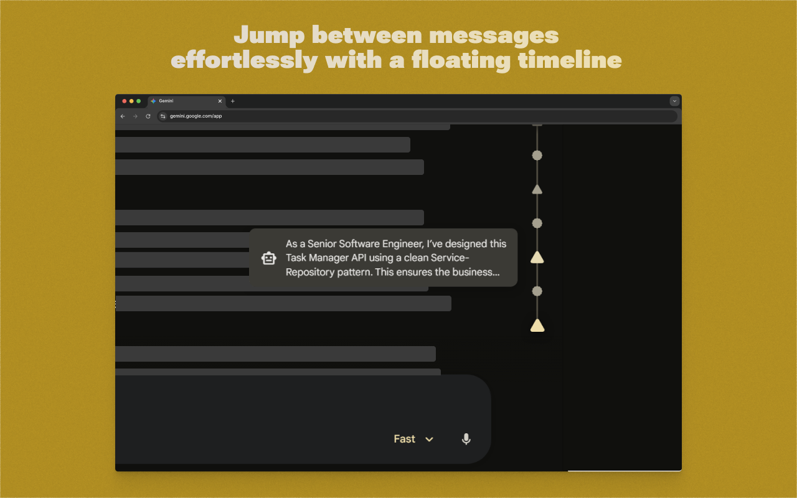
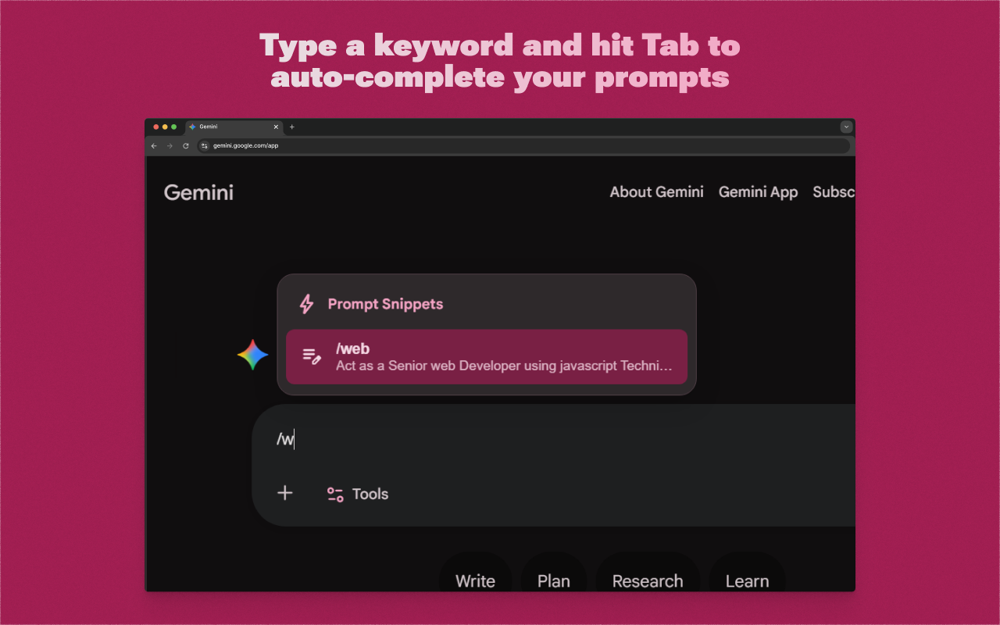
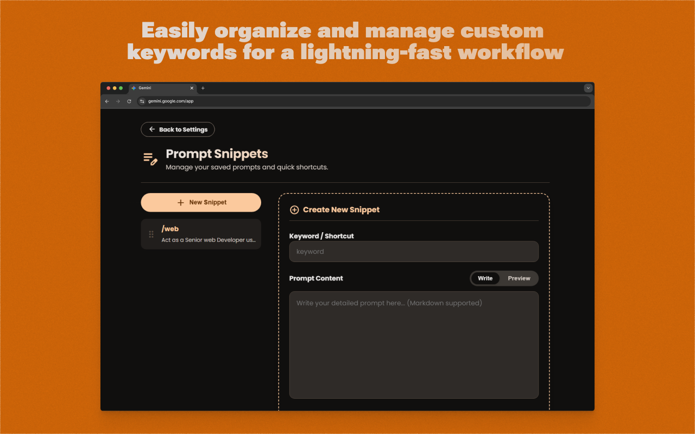
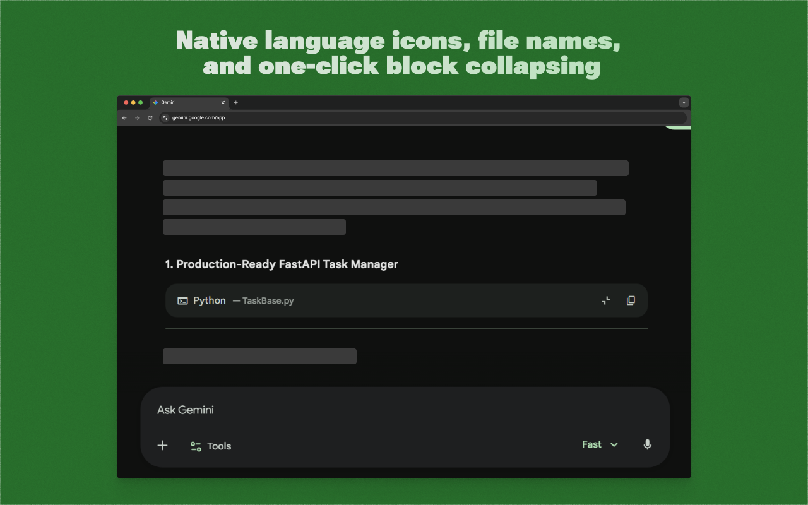
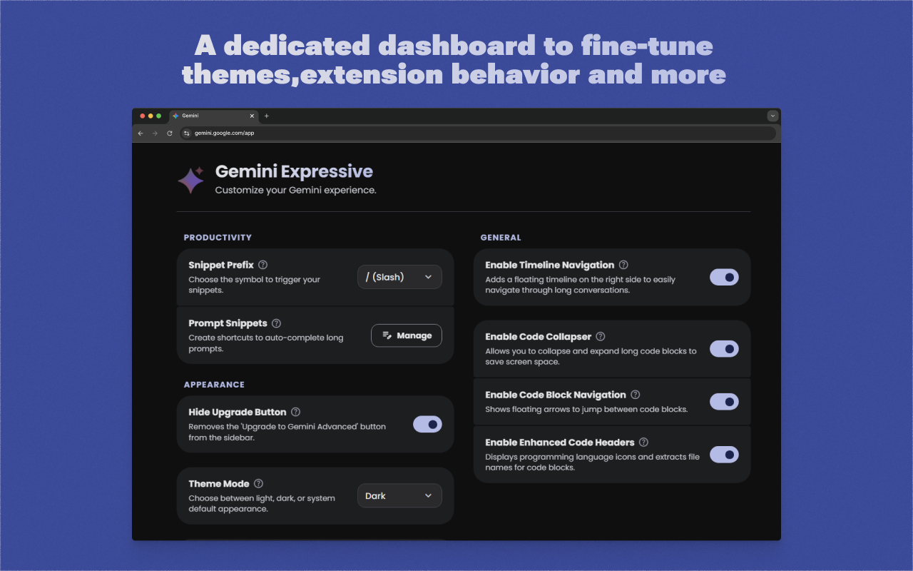

  

  <h1>✨ Gemini Expressive</h1>

  

    <strong>A powerful browser extension designed to supercharge the Google Gemini web interface.</strong> 
    Bring advanced productivity tools, seamless code management, and beautiful Material You theming directly to your workspace.
  

  
  
  
  

  

---

## 📥 Installation

The easiest way to get started is by visiting the **[Official Website](https://tools.fertwbr.com/geminiexpressive)**,
which will automatically detect your browser and guide you to the right download. Alternatively, you can install it
directly from your browser's extension store:

| Browser                                                                                                                                               |   Status    | Link                                                                                                                      |
|:------------------------------------------------------------------------------------------------------------------------------------------------------|:-----------:|:--------------------------------------------------------------------------------------------------------------------------|
|  **Chrome** |  Available  | [Get it on Chrome Web Store](https://chromewebstore.google.com/detail/gemini-expressive/onnljhamgihnkpcoickfmfhegimcgmho) |
|  **Firefox** |  Available  | [Get it on Mozilla Add-ons](https://addons.mozilla.org/en-US/firefox/addon/gemini-expressive/)                            |
|  **Edge** | *In Review* | Coming Soon ([Store Link](https://microsoftedge.microsoft.com/addons/detail/))                                            |

---

## 🚀 Features

### ⚡ Productivity & Workflow

Enhance your chat efficiency with tools designed for power users.

* **Prompt Shortcuts & Snippets:** Save your most-used prompts as quick snippets. Just type your custom keyword, hit
  `Tab`, and instantly auto-complete the full prompt text.
* **Chat Search:** Quickly search through your current conversation context to pinpoint exactly what you need without
  endless scrolling.
* **Timeline Navigation:** A sleek, floating timeline on the right side of the screen allows you to easily jump through
  long conversation threads.

  
  
    
  

### 💻 Developer Tools

Keep your workspace clean and easily read complex code structures.

* **Code Block Collapser:** Save screen space by collapsing and expanding long code blocks with a single click.
* **Code Block Navigation:** Hover over any code block to reveal quick-jump arrows, easily navigating between different
  code snippets in the chat.
* **Enhanced Code Headers:** Automatically detects programming languages, displays beautiful native icons, and elegantly
  extracts file names directly into the code headers.

  

### 🎨 Material 3 Expressive Theming

* **Dynamic Customization:** Choose between Light, Dark, or System default modes to match your environment.
* **Material You Palette:** Pick a dynamic seed color, and the extension will generate a fully integrated, custom
  Material You palette that seamlessly overrides the default Gemini UI.
* **Predefined Swatches:** Includes a wide variety of expressive, carefully crafted color swatches to personalize your
  workspace.

  

---

## 🌍 Supported Languages

The extension settings and interface are fully localized in **6 languages**:
🇺🇸 English (US/UK) &nbsp;•&nbsp; 🇧🇷 Portuguese (BR/PT) &nbsp;•&nbsp; 🇪🇸 Spanish &nbsp;•&nbsp; 🇩🇪 German &nbsp;•&nbsp;
🇮🇳 Hindi &nbsp;•&nbsp; 🇯🇵 Japanese

---

## ⚙️ Usage

Once installed, the extension seamlessly integrates into Gemini. Simply click the new **Expressive palette icon (`🎨`)**
injected directly into your Gemini left sidebar to access the full settings dashboard and customize your experience.

---

## 🤝 Contributing

Pull requests are always welcome! For major changes, please open an issue first to discuss what you would like to change
or propose new features.

## 📄 License

This project is licensed under the MIT License - see the [LICENSE](LICENSE) file for details.

 

  <b>Built by <a href="https://github.com/fertwbr">Fernando Vaz (fertw)</a></b> 🌐 <a href="https://fertw.com">fertw.com</a> 
  🛠️ <a href="https://tools.fertwbr.com/geminiexpressive">Gemini Expressive Official Page</a>

